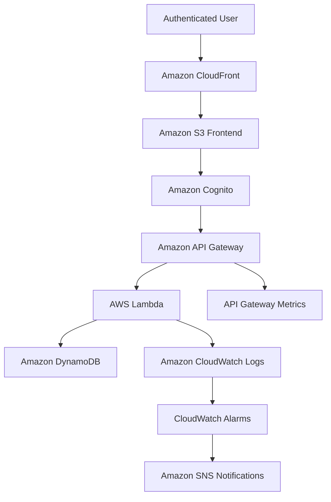

# Cloud Project 

## Build a Serverless Employee Management Application on AWS

## Overview

Build a serverless web application that allows authenticated users to add, view, update, and delete employee records. The application should be scalable, cost-effective, secure, and require no server management.

## Objective

Create a complete serverless employee management application using:

- AWS Lambda
- Amazon API Gateway
- Amazon DynamoDB
- Amazon S3
- Amazon CloudFront
- Amazon Cognito
- Amazon CloudWatch
- Amazon SNS

## Technical Requirements

### 1. Frontend

Build the frontend with HTML, CSS, and JavaScript. Host the static application using:

- Amazon S3 for static website assets
- Amazon CloudFront for global content delivery
- HTTPS for secure client connections

The frontend should provide authenticated users with an interface for managing employee records through the API.

### 2. API Layer

Configure Amazon API Gateway with the following REST endpoints:

| Method | Endpoint | Purpose |
| --- | --- | --- |
| `POST` | `/employees` | Add a new employee |
| `GET` | `/employees` | List all employees |
| `GET` | `/employees/{id}` | Retrieve an employee by ID |
| `PUT` | `/employees/{id}` | Update an employee |
| `DELETE` | `/employees/{id}` | Delete an employee |

Protect the API with Amazon Cognito authorization and return appropriate HTTP status codes and error responses.

### 3. Backend

Use AWS Lambda functions to implement the employee management operations:

- Add employee records
- Retrieve employee details
- List employees
- Update employee information
- Delete employee records

Lambda functions should validate input, handle errors, and use least-privilege IAM permissions when accessing other AWS services.

### 4. Database

Use Amazon DynamoDB to store employee records with the following attributes:

- Employee ID
- Name
- Email
- Department
- Designation
- Joining date

The employee ID should uniquely identify each record. Enable DynamoDB encryption at rest and design the table for predictable, scalable access through the API.

### 5. Security

Implement the following security controls:

- IAM roles with least-privilege access
- Amazon Cognito authentication for application users
- API Gateway authorization for protected endpoints
- DynamoDB encryption at rest
- HTTPS through Amazon CloudFront
- Input validation and safe error handling in Lambda functions
- No AWS credentials exposed in frontend source code

### 6. Monitoring and Notifications

Configure observability with:

- Amazon CloudWatch Logs for Lambda execution logs
- CloudWatch alarms for Lambda errors
- API Gateway metrics for request volume, latency, and failures
- Amazon SNS notifications for operational alerts

## Architecture Flow



### Request Flow

1. A user accesses the frontend through Amazon CloudFront.
2. CloudFront serves the static HTML, CSS, and JavaScript files from Amazon S3 over HTTPS.
3. Amazon Cognito authenticates the user and provides the authorization context for API requests.
4. API Gateway validates authorization and routes the request to the appropriate Lambda function.
5. Lambda validates the request and performs the requested CRUD operation in DynamoDB.
6. Lambda and API Gateway publish logs and metrics to CloudWatch.
7. CloudWatch alarms publish operational notifications through SNS when configured thresholds are exceeded.

## Suggested Project Structure

```text
.
├── frontend/
│   ├── index.html
│   ├── styles.css
│   └── app.js
├── backend/
│   ├── create_employee/
│   ├── list_employees/
│   ├── get_employee/
│   ├── update_employee/
│   └── delete_employee/
├── infrastructure/
│   └── README.md
└── README.md
```

## Deliverables

- Frontend source code
- Lambda functions for employee CRUD operations
- API Gateway configuration
- DynamoDB employee table
- Cognito user authentication
- CloudWatch logs and alarms
- SNS notification configuration
- Architecture diagram
- Project documentation

## Expected Outcome

The completed solution should be a secure and scalable serverless employee management application that provides:

- User authentication
- Employee CRUD operations
- Protected API access
- Encrypted data storage
- Centralized monitoring and alerting
- HTTPS delivery through CloudFront
- No server-management overhead

## AWS Services Summary

| Service | Responsibility |
| --- | --- |
| Amazon S3 | Hosts the static frontend assets |
| Amazon CloudFront | Provides global delivery and HTTPS |
| Amazon Cognito | Authenticates application users |
| Amazon API Gateway | Exposes and authorizes the REST API |
| AWS Lambda | Runs backend CRUD logic without servers |
| Amazon DynamoDB | Stores employee records |
| Amazon CloudWatch | Collects logs, metrics, and alarms |
| Amazon SNS | Sends operational notifications |
| AWS IAM | Controls least-privilege service access |

## Production Frontend Hosting

The frontend is hosted in Amazon S3 and delivered through Amazon CloudFront. A local web server is not required for the production application.

### Production URLs

- Application: `https://app.khansaiful.com/`
- CloudFront distribution: `https://d10we6vi99dsld.cloudfront.net/`
- S3 bucket: `employee-management-9876`

### Deploy the frontend

From the project root, synchronize the static frontend files to S3:

```bash
aws s3 sync frontend/ s3://employee-management-9876
```

Invalidate the CloudFront cache after changing `index.html`, `app.js`, or `styles.css`:

```bash
aws cloudfront create-invalidation \
	--distribution-id E2FM2XQERX0DGO \
	--paths '/index.html' '/app.js' '/styles.css'
```

Users should open `https://app.khansaiful.com/`. The frontend calls the remote API Gateway endpoint, while S3 and CloudFront serve the HTML, CSS, and JavaScript files.

### Cognito callback URLs

The Cognito app client must allow the exact production URLs below:

```text
https://app.khansaiful.com/
https://d10we6vi99dsld.cloudfront.net/
```

These URLs must be configured as both allowed callback URLs and allowed sign-out URLs. The local callback URL is only needed for local development and is not required for production hosting.
