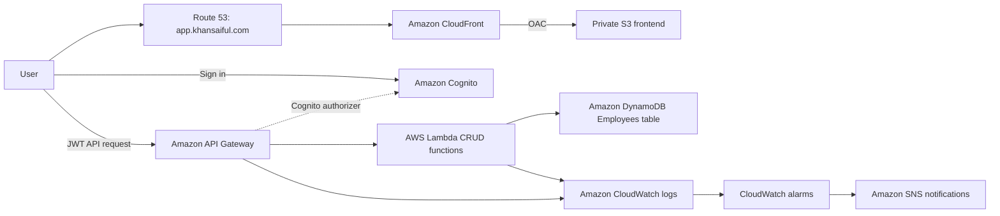

# Build and Deploy the Employee Management App

This guide explains how to build the serverless employee management application on AWS. Follow the build order below; the later sections contain the configuration details for each service.

## Architecture

The canonical editable AWS architecture is [../aws-employee-management-architecture.drawio](../aws-employee-management-architecture.drawio). It uses the official AWS service-icon library in Draw.io.



## Build Order

Before starting, install the AWS CLI and configure credentials with permission to create and manage the resources below. Use `us-east-1` for this project.

1. **Create DynamoDB.** Create the `Employees` table with `employeeId` as its string partition key.
2. **Create Lambda functions.** Create the five CRUD functions and give each function only the DynamoDB permission it needs.
3. **Create API Gateway.** Add the `/employees` and `/employees/{id}` routes, connect each route to Lambda, and deploy the API to the `prod` stage.
4. **Configure Cognito.** Create a user pool and public SPA app client using the authorization code flow. Add the production callback URL.
5. **Configure authorization and CORS.** Protect CRUD routes with the Cognito authorizer and leave `OPTIONS` routes public.
6. **Deploy the frontend.** Upload `frontend/index.html`, `frontend/app.js`, and `frontend/styles.css` to S3.
7. **Add CloudFront.** Use Origin Access Control, set `index.html` as the default root object, and point `app.khansaiful.com` to the distribution.
8. **Test the application.** Open `https://app.khansaiful.com/`, sign in, and test adding, editing, searching, and deleting an employee.

The application is designed for production hosting through S3 and CloudFront. A local web server is optional and is only useful while developing the frontend.

### Important values

| Resource | Value |
| --- | --- |
| AWS region | `us-east-1` |
| Frontend URL | `https://app.khansaiful.com/` |
| S3 bucket | `employee-management-9876` |
| API base URL | `https://erwk803l40.execute-api.us-east-1.amazonaws.com/prod` |
| CloudFront distribution | `E2FM2XQERX0DGO` |

## AWS Region

The application resources were created in:

```text
us-east-1 (US East - N. Virginia)
```

Keep CloudFront ACM certificates in `us-east-1`, even when other AWS resources use a different region.

## 1. DynamoDB

### Table configuration

Create a DynamoDB table with:

```text
Table name: Employees
Partition key: employeeId
Key type: String
Encryption at rest: Enabled
```

Employee records use these attributes:

- `employeeId`
- `name`
- `email`
- `department`
- `designation`
- `joiningDate`

DynamoDB does not require non-key attributes to be declared when creating the table. They are stored with each item written by Lambda.

### Employee ID

The `employeeId` value is the DynamoDB partition key and must be present on every item. New IDs are generated by the create Lambda. Existing records must use the exact same ID for get, update, and delete operations.

Example ID formats:

```text
8ecc2b95-85fe-46dc-b5fc-90e25382ffc7
EMP-8ECC2B95
```

## 2. Lambda Functions

Create one Python 3.12 Lambda function for each operation:

| Function | Operation | DynamoDB action |
| --- | --- | --- |
| `list-employees` | List employee records | `Scan` |
| `create-employee` | Add an employee | `PutItem` |
| `get-employee` | Retrieve one employee | `GetItem` |
| `update-employee` | Update an employee | `UpdateItem` |
| `delete-employee` | Delete an employee | `DeleteItem` |

Enable Lambda proxy integration in API Gateway so the Lambda function receives the request path and body directly.

### List employees

```python
import json
import boto3


table = boto3.resource("dynamodb").Table("Employees")


def lambda_handler(event, context):
    response = table.scan()

    return {
        "statusCode": 200,
        "headers": {
            "Content-Type": "application/json",
            "Access-Control-Allow-Origin": "*"
        },
        "body": json.dumps(response.get("Items", []))
    }
```

For larger tables, replace a single `scan()` call with pagination using `LastEvaluatedKey`.

### Create employee

```python
import json
import uuid
import boto3


table = boto3.resource("dynamodb").Table("Employees")


def lambda_handler(event, context):
    body = json.loads(event.get("body", "{}"))

    employee = {
        "employeeId": body.get("employeeId", f"EMP-{uuid.uuid4().hex[:8].upper()}"),
        "name": body["name"],
        "email": body["email"],
        "department": body["department"],
        "designation": body["designation"],
        "joiningDate": body["joiningDate"]
    }

    table.put_item(Item=employee)

    return {
        "statusCode": 201,
        "headers": {
            "Content-Type": "application/json",
            "Access-Control-Allow-Origin": "*"
        },
        "body": json.dumps(employee)
    }
```

### Get employee

Use the path parameter supplied by API Gateway:

```python
employee_id = event["pathParameters"]["id"]
response = table.get_item(Key={"employeeId": employee_id})
```

Return `200` with the item when it exists and `404` when it does not.

### Update employee

The update function reads:

```python
employee_id = event["pathParameters"]["id"]
body = json.loads(event.get("body", "{}"))
```

It updates `name`, `email`, `department`, `designation`, and `joiningDate` with DynamoDB `UpdateItem`, using `ReturnValues="ALL_NEW"` to return the updated item.

### Delete employee

The delete function reads the exact path parameter and calls:

```python
employee_id = event["pathParameters"]["id"]
table.delete_item(Key={"employeeId": employee_id})
```

The API should return `200` and the deleted employee ID. A delete request must use only the ID value, for example:

```text
db72eeb7-dd28-412f-8100-cbf78a0bff52
```

## 3. IAM Permissions

Each Lambda function should use its own execution role with least-privilege DynamoDB access.

| Lambda | Required action |
| --- | --- |
| `list-employees` | `dynamodb:Scan` |
| `create-employee` | `dynamodb:PutItem` |
| `get-employee` | `dynamodb:GetItem` |
| `update-employee` | `dynamodb:UpdateItem` |
| `delete-employee` | `dynamodb:DeleteItem` |

Each policy should restrict `Resource` to the `Employees` table ARN:

```text
arn:aws:dynamodb:us-east-1:<account-id>:table/Employees
```

Lambda roles also need the basic CloudWatch Logs permissions created by the Lambda console. Avoid using broad managed policies in production once the individual permissions have been verified.

## 4. API Gateway

The REST API was created with these resources and methods:

| Method | Resource | Lambda |
| --- | --- | --- |
| `GET` | `/employees` | `list-employees` |
| `POST` | `/employees` | `create-employee` |
| `GET` | `/employees/{id}` | `get-employee` |
| `PUT` | `/employees/{id}` | `update-employee` |
| `DELETE` | `/employees/{id}` | `delete-employee` |

Lambda proxy integration is enabled for each method. Deploy API changes to the `prod` stage after adding or changing a method.

### Current API endpoint

```text
https://erwk803l40.execute-api.us-east-1.amazonaws.com/prod
```

### CORS

The frontend runs from S3 through CloudFront in production. API Gateway must allow:

```text
Access-Control-Allow-Origin: *
Access-Control-Allow-Headers: Content-Type,X-Amz-Date,Authorization,X-Api-Key,X-Amz-Security-Token
```

The allowed methods are:

```text
GET,POST,PUT,DELETE,OPTIONS
```

The `OPTIONS` methods must be unauthenticated. Protect the CRUD methods with Cognito, but never protect the browser preflight request. After changing CORS, deploy the API to `prod`.

## 5. Cognito Authentication

### User pool

Create or use a Cognito user pool in `us-east-1`. Create a test user and confirm the user before testing login.

### Public SPA app client

Use a public Single-page application client without a client secret:

```text
Client name: employee-management-spa
Client ID: 2gk27p1kl8cclipgsa5s55spfj
```

Never put a client secret in browser JavaScript.

### Managed Login domain

```text
https://us-east-1bbtxoe8nm.auth.us-east-1.amazoncognito.com
```

The managed login domain must be active and the app client must have a managed-login branding association. The client uses:

```text
OAuth flow: Authorization code
Scopes: openid, email, phone
Production callback URL: https://app.khansaiful.com/
Production sign-out URL: https://app.khansaiful.com/
```

For direct CloudFront access, also allow:

```text
https://d10we6vi99dsld.cloudfront.net/
```

Localhost is optional and only needed for local development:

```text
http://localhost:8080/
```

The production application uses:

```text
https://app.khansaiful.com/
```

### API Gateway authorizer

Create a Cognito user-pool authorizer with:

```text
Name: employee-cognito-authorizer
Token source: Authorization
User pool: the pool containing employee-management-spa
```

Attach it to all CRUD methods. The `OPTIONS` methods remain public for CORS.

## 6. Frontend API Authentication

The frontend configuration is in `frontend/app.js`:

```javascript
const API_BASE_URL = 'https://erwk803l40.execute-api.us-east-1.amazonaws.com/prod';
const COGNITO_DOMAIN = 'https://us-east-1bbtxoe8nm.auth.us-east-1.amazoncognito.com';
const COGNITO_CLIENT_ID = '2gk27p1kl8cclipgsa5s55spfj';
const REDIRECT_URI = `${window.location.origin}/`;
```

The frontend:

1. Redirects unauthenticated users to Cognito Managed Login.
2. Exchanges the authorization code at `/oauth2/token`.
3. Stores the ID token in `sessionStorage`.
4. Sends the token directly in the API Gateway `Authorization` header.
5. Loads employee records only after authentication succeeds.

## 7. S3 Frontend Hosting

The production frontend is hosted in S3 and delivered through CloudFront. A local web server is not required. The deployed application is available at `https://app.khansaiful.com/`.

Use the existing private bucket in `us-east-1` and keep **Block all public access** enabled:

```text
Bucket: employee-management-9876
```

Upload these files to the bucket root:

```text
index.html
styles.css
app.js
```

Do not place them under an extra `frontend/` directory unless the CloudFront origin path is configured for it.

From the project root, deploy the frontend with:

```bash
aws s3 sync frontend/ s3://employee-management-9876
```

After deployment, invalidate cached files so CloudFront serves the latest version:

```bash
aws cloudfront create-invalidation \
    --distribution-id E2FM2XQERX0DGO \
    --paths '/index.html' '/app.js' '/styles.css'
```

Use CloudFront Origin Access Control so only CloudFront can read the bucket.

## 8. CloudFront

The employee-management distribution is:

```text
Distribution ID: E2FM2XQERX0DGO
CloudFront domain: d10we6vi99dsld.cloudfront.net
Custom domain: app.khansaiful.com
```

The resume distribution remains separate:

```text
Distribution ID: E2ZAVM7W2WEI3R
```

Do not replace the resume distribution origin with the employee-management bucket.

Configure the employee distribution with:

- S3 REST endpoint as the origin, not an S3 website endpoint
- Origin Access Control
- `index.html` as the default root object
- HTTPS redirect
- ACM wildcard certificate `*.khansaiful.com`
- Alternate domain `app.khansaiful.com`

## 9. Route 53

The public hosted zone is:

```text
khansaiful.com
```

The employee app uses an alias record:

```text
Name: app.khansaiful.com
Type: A (Alias)
Target: d10we6vi99dsld.cloudfront.net
```

An AAAA alias may also be present for IPv6. An alias A record is preferred when selecting the CloudFront distribution directly in Route 53. A CNAME is also valid when entering the CloudFront hostname manually, but do not create both A and CNAME records for the same name.

## 10. ACM

CloudFront certificates must be requested or imported in:

```text
us-east-1
```

The wildcard certificate must cover:

```text
*.khansaiful.com
```

This covers `app.khansaiful.com` but not the apex `khansaiful.com`.

## 11. CloudWatch and SNS

Lambda automatically sends execution logs to CloudWatch when its role includes log permissions. Create alarms for Lambda errors:

```text
Metric: Lambda Errors
Statistic: Sum
Period: 5 minutes
Threshold: Greater than or equal to 1
```

Create an SNS topic for notifications and confirm the email subscription. Repeat the alarm setup for the CRUD functions or create a consolidated operational monitoring plan.

API Gateway metrics to monitor include:

- Count
- Latency
- 4XX errors
- 5XX errors

## Quick Troubleshooting

### Cognito redirects to localhost

Open `https://app.khansaiful.com/` directly. Add the exact production URL, including the trailing slash, to the Cognito callback and sign-out URLs.

### Cognito returns `400 Bad Request`

Check that the `redirect_uri` in the browser exactly matches a URL registered in the Cognito app client. `http://localhost:8080/` and `https://app.khansaiful.com/` are different URLs.

### The latest frontend changes are not visible

Upload the files to S3, then invalidate the CloudFront paths for `index.html`, `app.js`, and `styles.css`.

### API requests fail after login

Confirm the API is deployed to the `prod` stage, the Cognito token is sent in the `Authorization` header, and CORS allows `Authorization` while leaving `OPTIONS` public.

### The production page does not load

Check that the Route 53 `app` record points to CloudFront, the CloudFront distribution is deployed, and the S3 origin uses Origin Access Control.

## Deployment Checklist

- [ ] DynamoDB `Employees` table is active.
- [ ] Lambda CRUD functions are deployed.
- [ ] Lambda roles use table-scoped permissions.
- [ ] API Gateway methods are deployed to `prod`.
- [ ] CORS allows `Authorization` and leaves `OPTIONS` public.
- [ ] Cognito public SPA client has no secret.
- [ ] Cognito callback and sign-out URLs include `https://app.khansaiful.com/`.
- [ ] Cognito callback and sign-out URLs include the CloudFront origin when it is used directly.
- [ ] Managed Login branding is associated with the SPA client.
- [ ] Frontend files are at the S3 bucket root.
- [ ] CloudFront OAC can read the bucket.
- [ ] CloudFront distribution is deployed.
- [ ] Route 53 `app` record targets the employee CloudFront distribution.
- [ ] ACM certificate is issued in `us-east-1`.
- [ ] CloudWatch alarms and SNS email confirmation are complete.
